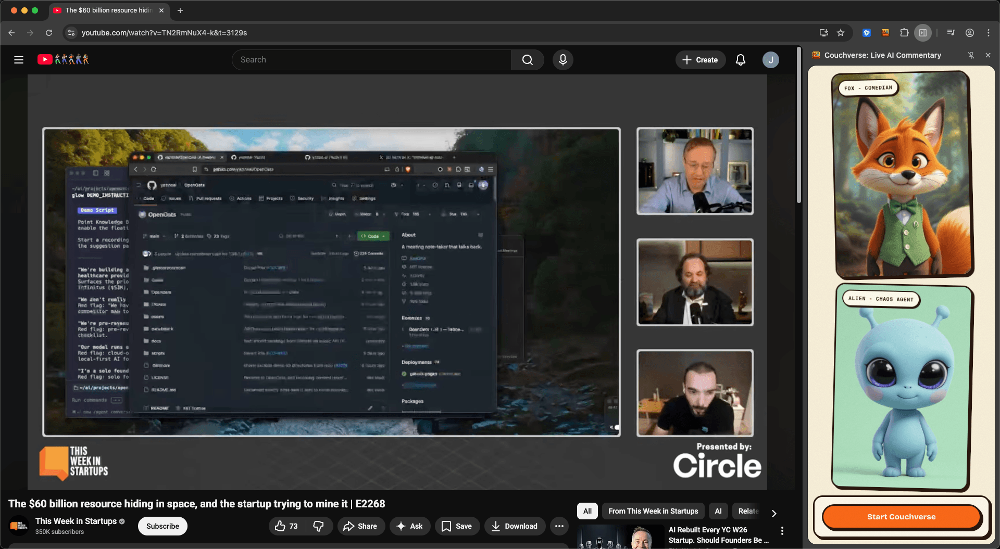

# Watch with Fox: Never watch YouTube alone again

[](LICENSE)

A Chrome extension and Python backend where users watch YouTube alongside **Fox**, an AI comedian avatar that delivers real-time comedic commentary. Think MST3K meets AI: Fox listens to the video's audio, understands what's being discussed, and drops witty one-liners and observations via an animated talking fox avatar.

<p align="center">
  
</p>

## Architecture

```
┌──────────────────────┐       ┌──────────────────┐       ┌──────────────────────┐
│  Chrome extension    │──────▶│  FastAPI server  │       │   LiveKit Agent      │
│  (chrome_extension/) │       │  (server/)       │       │   (server/)          │
│                      │       │                  │       │                      │
│  - YouTube tab audio │       │  - Session mgmt  │       │  - Groq Whisper STT  │
│    via tabCapture    │       │  - Token gen     │       │  - Llama Scout LLM   │
│  - LiveKit publish   │       │  - Neon Postgres │       │  - ElevenLabs TTS    │
│  - Avatar side panel │       │                  │       │  - LemonSlice avatar │
└──────────┬───────────┘       └──────────────────┘       └──────────┬───────────┘
           │                                                         │
           └──────────────── LiveKit Cloud (WebRTC) ─────────────────┘
```

The Chrome extension is the only frontend. It captures YouTube tab audio via `chrome.tabCapture` and publishes it as a LiveKit track. The agent subscribes to that track for STT — no server-side audio extraction or decoding.

## Quick start

You need a few API keys before running anything: [LiveKit Cloud](https://cloud.livekit.io/), [Groq](https://console.groq.com/), [ElevenLabs](https://elevenlabs.io/), and [LemonSlice](https://www.lemonslice.com/). [Neon](https://neon.tech/) is optional — without `DATABASE_URL` the app runs without persistence.

```bash
# 1. Clone
git clone https://github.com/lemonsliceai/watch-with-fox.git
cd watch-with-fox

# 2. Install + configure the server
cd server
uv sync
uv run python src/podcast_commentary/agent/main.py download-files
cp .env.example .env       # then fill in your API keys

# 3. Build the extension
cd ../chrome_extension
npm install && npm run build

# 4. Start the API (terminal 1)
cd ../server
uv run uvicorn podcast_commentary.api.app:app --host 0.0.0.0 --port 8080 --reload

# 5. Start the agent (terminal 2)
cd server
uv run python src/podcast_commentary/agent/main.py dev

# 6. Load the extension
#    chrome://extensions → enable Developer mode → Load unpacked → chrome_extension/
#    Then open a YouTube video and click the extension icon.
```

For more detail, see:

- [`server/README.md`](server/README.md) — server commands, FoxConfig presets, deployment
- [`chrome_extension/README.md`](chrome_extension/README.md) — extension build/load steps, troubleshooting, API URL behaviour

## Project layout

```
├── chrome_extension/   # The frontend — MV3 extension with side panel UI
├── server/             # FastAPI HTTP server + LiveKit AI agent
│   ├── src/podcast_commentary/api/    # Session/token endpoints
│   ├── src/podcast_commentary/agent/  # ComedianAgent + STT/LLM/TTS pipeline
│   └── migrations/                     # PostgreSQL schema
├── CLAUDE.md           # Architecture overview for AI assistants
└── docs/               # Screenshots and supplementary docs
```

## Contributing

Contributions are welcome — see [CONTRIBUTING.md](CONTRIBUTING.md) before opening a pull request.

## Security

See [SECURITY.md](SECURITY.md) for vulnerability reporting instructions.

## License

MIT — see [LICENSE](LICENSE).
